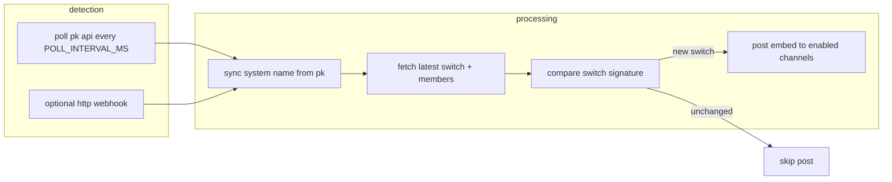

# pk-switch-tracker

a discord bot that watches [pluralkit](https://pluralkit.me) systems for front changes and posts switch embeds to channels you configure. each user links their own pk api token. the bot stores it (encrypted) and polls pluralkit (optional http webhook).

*note:* there may be code segments that use the name puppyk. this is what my instance of the bot is named ([invite link!](https://discord.com/api/oauth2/authorize?client_id=1494044928412487814&permissions=19456&scope=bot%20applications.commands)). be sure to change as needed!

## features

- **per-user linking** — one pluralkit system per discord account via `/link-system`
- **multi-channel routing** — post the same switch to multiple guild channels
- **per-channel enable/disable** — keep overall channel configs while toggling individual channel config
- **global on/off** — pause all posting without losing settings
- **display vs registered names** — choose how member names appear in embeds
- **timezone-based timestamps** — iana timezones on switch embeds
- **live system name sync** — system display names refresh from pluralkit on each poll
- **resilient pk api client** — configurable timeout and retries for slow or flaky api responses
- **optional webhook listener** — accept switch payloads over http when you have an integration that forwards them
- **custom int status** — set optional status text on switch embeds via `/int-status`
- **encrypted at rest** — pk tokens, system names, and int status stored encrypted in sqlite
- **dev mode** — restrict switch posting to a single test guild while developing

## requirements

- **node.js** 22.5 or newer (uses built-in `node:sqlite`)
- a discord application with a bot user
- network access to `discord.com` and `api.pluralkit.me`

## quick start

### 1. clone and install

```bash
git clone https://github.com/patelr0324/pk-switch-tracker.git
cd pk-switch-tracker
npm install
```

### 2. create a discord application

1. open the [discord developer portal](https://discord.com/developers/applications) and create an application.
2. go to **bot** → **reset token** and copy the bot token (this is `DISCORD_TOKEN`). never commit it.
3. copy the **application id** from **general information** (this is `DISCORD_CLIENT_ID`).
4. under **bot → privileged gateway intents**, you do not need message content, server members, or presence. the bot only uses the default guilds intent.

### 3. invite the bot to your server

use **oauth2 → url generator** with:

| setting | value |
|--------|--------|
| **scopes** | `bot`, `applications.commands` |
| **bot permissions** | view channels, send messages, embed links |

or use this url (replace `YOUR_CLIENT_ID`):

```
https://discord.com/api/oauth2/authorize?client_id=YOUR_CLIENT_ID&permissions=19456&scope=bot%20applications.commands
```

in each channel where switches should post, ensure the bot role can **view channel**, **send messages**, and **embed links** (check channel permission overrides if posts fail).

### 4. configure environment variables

```bash
cp .env.example .env
```

edit `.env` and set at least the required values (see [configuration](#configuration)).

generate a 32-byte encryption key:

```bash
node -e "console.log(require('crypto').randomBytes(32).toString('hex'))"
```

put the output in `TOKEN_ENCRYPTION_KEY`. if you lose this, stored tokens and encrypted fields cannot be decrypted and users must run `/link-system` again.

### 5. register slash commands

```bash
npm run register-commands
```

- with `DEV_MODE=false` (default), commands register globally (can take up to an hour to appear everywhere).
- with `DEV_MODE=true` and `DISCORD_GUILD_ID` set, commands register only to that guild (instant).

### 6. start the bot

```bash
npm start
```

you should see login success, poll/webhook startup logs, and no missing-env errors if all went well

---

## configuration

all settings are loaded from `.env` via `dotenv`. see `.env.example` for a template.

### required

| variable | description |
|----------|-------------|
| `DISCORD_TOKEN` | bot token from the developer portal |
| `DISCORD_CLIENT_ID` | application (client) id |
| `TOKEN_ENCRYPTION_KEY` | 32-byte key: 64-char hex, 32-byte base64, or exactly 32 utf-8 characters. used to encrypt pk api tokens, system names, and int status at rest. |

### optional

| variable | default | description |
|----------|---------|-------------|
| `DISCORD_GUILD_ID` | _(empty)_ | guild id for dev-scoped command registration and dev-mode posting filter |
| `DATABASE_PATH` | `./data/bot.db` | path to the sqlite database file (resolved from project root). if it still ends in `.json`, a sibling `.db` is used and the json is imported once when empty. |
| `PK_API_BASE` | `https://api.pluralkit.me/v2` | pluralkit api base url |
| `PK_API_TIMEOUT_MS` | `45000` | http timeout per pk request (milliseconds) |
| `PK_API_MAX_RETRIES` | `4` | extra retry attempts on transient errors (timeouts, connection resets, 429, 502–504) |
| `POLL_INTERVAL_MS` | `30000` | how often to poll pk for new switches (milliseconds) |
| `WEBHOOK_PORT` | `8787` | port for the optional http webhook listener |
| `WEBHOOK_PATH` | `/pk-webhook` | url path for webhook posts |
| `WEBHOOK_SECRET` | _(empty)_ | if set, requests must send header `x-webhook-secret` with this value |
| `DEV_MODE` | `false` | when `true`, switch posts only go to channels in `DISCORD_GUILD_ID` |

### example `.env`

```env
DISCORD_TOKEN=your_bot_token
DISCORD_CLIENT_ID=1234567890123456789
DISCORD_GUILD_ID=9876543210987654321
TOKEN_ENCRYPTION_KEY=abcdef0123456789abcdef0123456789abcdef0123456789abcdef0123456789
DATABASE_PATH=./data/bot.db
POLL_INTERVAL_MS=30000
PK_API_TIMEOUT_MS=45000
PK_API_MAX_RETRIES=4
DEV_MODE=false
```

---

## user guide (slash commands)

commands are ephemeral by default (only you see the confirmation)

### `/link-system`

links your discord account to a pluralkit system.

| option | required | description |
|--------|----------|-------------|
| `token` | yes | your pluralkit api token ([how to get one](https://pluralkit.me/faq#how-do-i-get-an-api-token)) |
| `timezone` | no | iana timezone (e.g. `America/Chicago`). defaults to `UTC` |

re-running this updates your token, timezone, and system metadata. each discord user can link one system only.

### `/switches`

manage posting (requires a linked system).

| subcommand | description |
|------------|-------------|
| `enable` | turn on switch posting globally |
| `disable` | turn off switch posting globally (channel list is kept) |
| `add-channel` | add a text channel and enable it |
| `remove-channel` | remove a channel from your config |
| `list-channels` | show configured channels and enabled/disabled status |
| `enable-channel` | enable posting for an existing channel |
| `disable-channel` | disable posting for a channel without removing it |
| `set-name-mode` | `display` or `registered` — which member name field to show |

**typical setup flow**

1. `/link-system` with your pk token  
2. `/switches enable`  
3. `/switches add-channel` for each destination channel  
4. optionally `/switches set-name-mode`, `/timezone set`, or `/int-status set`

### `/timezone`

| subcommand | description |
|------------|-------------|
| `set` | set iana timezone for embed timestamps |
| `get` | show current timezone and member name mode |

### `/int-status`

set or clear custom status text shown on switch embeds as an **int status** field (above **time**).

| subcommand | description |
|------------|-------------|
| `set` | set status text (max 400 characters) |
| `clear` | remove your int status |

changing or clearing your status bumps an internal revision so the **latest switch reposts** on the next poll cycle with the updated embed. this is not instant — it happens on the next successful poll (default every 30 seconds). clearing removes the field from future reposts.

> after adding this command for the first time, run `npm run register-commands` and restart the bot.

---

## how switch detection works



1. **polling** — on an interval, the bot checks every linked system that has posting enabled. it fetches the latest switch from pluralkit and compares a signature (switch id, or timestamp + members + names, plus interaction status revision) to the last posted switch.
2. **webhooks** — a small http server accepts `POST` requests on `WEBHOOK_PATH`. if the payload includes a system id and switch data, that system is processed immediately; otherwise a full poll runs.
3. **embeds** — title uses the pk system name. body lists fronting members. an optional **int status** field (above **time**) appears when set via `/int-status`. thumbnail/color come from the first member (if applicable). the order of members will mimic the order put in while switching on pluralkit.
4. **deduplication** — the same switch is not posted twice. changing your int status counts as a change and reposts the latest switch. if no channel accepts the message, the signature is not advanced (so a later retry can still post).

the relay pipeline lives in `switchWorker.js` (poll loop, dedup, discord posting). member lookup, embed building, and switch signatures live in `members.js`. pluralkit http calls go through `pkClient.js` (timeouts + retries on transient errors).

---

## optional webhook setup

the bot listens on `http://0.0.0.0:WEBHOOK_PORT` + `WEBHOOK_PATH` (default `http://localhost:8787/pk-webhook`).

- **method:** `POST`
- **content-type:** json body
- **auth (optional):** header `x-webhook-secret: <WEBHOOK_SECRET>` when `WEBHOOK_SECRET` is set

the handler recognizes payloads roughly like:

```json
{
  "system": { "id": "abcd12" },
  "switch": {
    "id": "...",
    "timestamp": "2026-05-25T12:00:00Z",
    "members": ["member_id_or_object"]
  }
}
```

variants with `system_id`, `data.system`, or a top-level switch object are also supported.

if the webhook port is already in use, the bot logs a warning and continues with polling only.

for production behind a reverse proxy, terminate tls at nginx/caddy and forward to `WEBHOOK_PORT`. expose only if you trust the network or use `WEBHOOK_SECRET`.

---

## development mode

set `DEV_MODE=true` and `DISCORD_GUILD_ID` to your test server:

- `npm run register-commands` registers commands **only** in that guild.
- switch embeds are sent **only** to channels whose `guild_id` matches `DISCORD_GUILD_ID` (other configured channels are ignored until dev mode is off).

use this to test without posting to production servers. you also don't need to wait for commands to propogate globally for faster testing. the bot will remain down in other servers while in dev mode.

---

## data storage

- state is a local sqlite file at `DATABASE_PATH` (default `./data/bot.db`), using node’s built-in `node:sqlite` (node `>=22.5`).
- encrypted at rest with `TOKEN_ENCRYPTION_KEY`: pk api tokens, `system_name`, `interaction_status`.
- plaintext: discord ids, channel mappings, enable flags, timezones, name preference, last-switch signatures, revision counters.
- legacy json: if the db is empty and `bot-data.json` is present next to it (or `DATABASE_PATH` still ends in `.json`), it is imported once and renamed to `*.json.bak`.
- the `data/` directory is gitignored. when moving hosts, copy the db file **and** use the same `TOKEN_ENCRYPTION_KEY`.
- on panel hosts, set secrets in env vars — do not upload `.env` with tokens in it.

**do not commit** `.env` or your database file.

---

## long-running deployment

### process manager (recommended)

use **pm2**, **systemd**, or similar so the bot restarts on crash or reboot.

```bash
npm install -g pm2
pm2 start src/index.js --name pk-switch-tracker
pm2 save
pm2 startup
```

### updates

```bash
git pull
npm install
npm run register-commands   # only if commands changed
pm2 restart pk-switch-tracker
```

### logs to watch for

| message | meaning |
|---------|---------|
| `failed to fetch latest switch` | pk api error for one system; will retry next poll |
| `failed to refresh system name` | name sync failed; posting may still work with cached name |
| `failed to send ... switch` | discord permission or missing channel |
| `switch relay failed ... no channels accepted` | no enabled channel could receive the message |
| `webhook port ... already in use` | webhook disabled; polling still runs |
| `migrated legacy json database ...` | one-time import from `bot-data.json` into sqlite completed |
| `dev mode enabled: posting scoped to guild` | dev mode active |

### tuning api reliability

if pluralkit is slow or you see timeout errors:

```env
PK_API_TIMEOUT_MS=60000
PK_API_MAX_RETRIES=5
POLL_INTERVAL_MS=45000
```

higher poll intervals reduce api load but increase detection delay.

### backups

1. stop the bot (or copy while running)
2. copy `DATABASE_PATH` and secure store for `TOKEN_ENCRYPTION_KEY` and `.env`

### rotating secrets

| secret | action |
|--------|--------|
| discord bot token | reset in developer portal, update `.env`, restart |
| `TOKEN_ENCRYPTION_KEY` | generate new key, restart — **all users must `/link-system` again** (names/status in the old db also become unreadable) |
| user pk token | user runs `/link-system` with a new token |

---

## troubleshooting

| problem | things to check |
|---------|------------------|
| slash commands missing | run `npm run register-commands`; wait for global propagation or use dev guild + `DEV_MODE=true` |
| bot online but no posts | `/switches enable`, channel added, channel enabled, global disable off |
| posts in wrong server during testing | `DEV_MODE` and `DISCORD_GUILD_ID` |
| `Missing required environment variable` | `.env` in project root; required vars set |
| `failed to validate pluralkit token` | token copied correctly; pk account has api access |
| embeds fail in one channel | bot permissions in that channel; channel still exists |
| duplicate posts after bot downtime | rare edge case if signature was not saved; usually self-corrects on next switch |
| old system name on embeds | wait one poll cycle after renaming on pk, or re-run `/link-system` |
| int status didn't repost | wait for next poll; ensure `/switches enable` and at least one channel is enabled |
| timeout / econnreset errors | raise `PK_API_TIMEOUT_MS` or `PK_API_MAX_RETRIES`; check network to `api.pluralkit.me` |
| decrypt / invalid encrypted payload errors | `TOKEN_ENCRYPTION_KEY` must match the key used when the db was written; restore the old key or have users `/link-system` again |

---

## project structure

```
pk-switch-tracker/
├── data/                    # local database (gitignored); created at runtime
├── src/
│   ├── index.js             # entry: discord client, starts relay + webhook server
│   ├── config.js            # loads .env / required settings
│   ├── commands.js          # slash command definitions and handlers
│   ├── registerCommands.js  # one-off script to register slash commands with discord
│   ├── switchWorker.js      # poll loop, system name sync, dedup, post to channels
│   ├── members.js           # member name resolution, hydration, embeds, signatures
│   ├── intStatus.js         # int status validation and embed field label
│   ├── format.js            # switch timestamp formatting for embeds
│   ├── pkClient.js          # pluralkit api client (timeout, retries)
│   ├── webhookServer.js     # optional http listener for incoming switch payloads
│   ├── webhookPayload.js    # parses webhook json into system/switch ids
│   ├── db.js                # sqlite database (systems, channels, last switch)
│   └── crypto.js            # encrypt/decrypt sensitive fields at rest (aes-256-gcm)
├── .env.example
├── package.json
└── README.md
```

### what each module does

| file | responsibility |
|------|----------------|
| `index.js` | wires discord, database, pk client, relay, and webhook server together |
| `switchWorker.js` | per-system poll/webhook handling: decrypt token → refresh name → fetch switch → post |
| `members.js` | resolve/hydrate fronting members and build the discord embed |
| `intStatus.js` | int status text validation, length limits, embed field label |
| `pkClient.js` | all pluralkit `GET` requests; retries on timeouts, connection resets, 429, 502–504 |
| `webhookServer.js` | `POST` handler on `WEBHOOK_PORT` + `WEBHOOK_PATH` |
| `webhookPayload.js` | extract `system_id` and switch object from webhook body shapes |
| `commands.js` | `/link-system`, `/switches`, `/timezone`, `/int-status` |
| `db.js` | sqlite at `DATABASE_PATH` (systems, channels, dedup state; encrypts names/status) |

---


## security notes

- pluralkit api tokens, system names, and int status are encrypted at rest with `TOKEN_ENCRYPTION_KEY`.
- tokens are sent only to pluralkit over https during polls.
- slash command replies for linking are ephemeral so tokens are not broadcast to the channel.
- run the bot on infrastructure you trust; anyone with server filesystem *and* env access can decrypt. a leaked db file alone is not enough without the key.
- use `WEBHOOK_SECRET` if the webhook port is reachable from a network.

---

## license

mit — see [license](LICENSE).

---

## acknowledgments

- [pluralkit](https://pluralkit.me) for the api and proxy system
- [discord.js](https://discord.js.org/) for the discord integration
